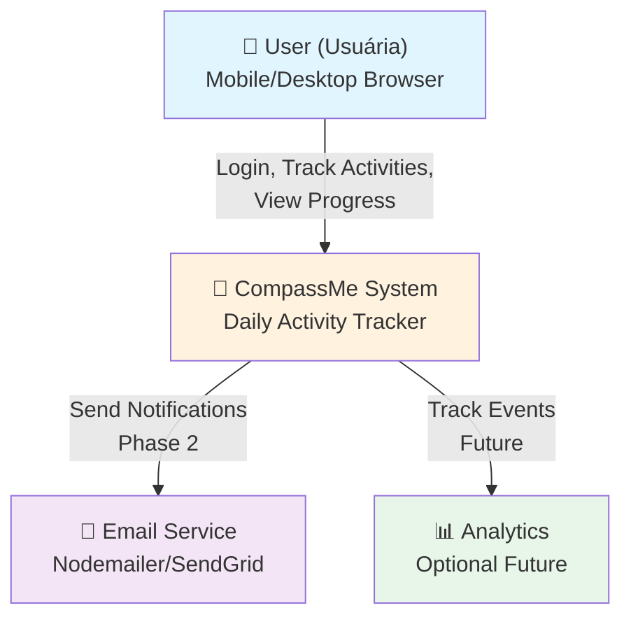

# C4 System Context Diagram - CompassMe

```mermaid
graph TB
    User["👤 User (Usuária)<br/>Mobile/Desktop Browser"]
    CompassMe["🎯 CompassMe System<br/>Daily Activity Tracker"]
    Email["📧 Email Service<br/>Nodemailer/SendGrid"]
    Analytics["📊 Analytics<br/>Optional Future"]
    
    User -->|Login, Track Activities,<br/>View Progress| CompassMe
    CompassMe -->|Send Notifications<br/>Phase 2| Email
    CompassMe -->|Track Events<br/>Future| Analytics
    
    style User fill:#e1f5ff
    style CompassMe fill:#fff3e0
    style Email fill:#f3e5f5
    style Analytics fill:#e8f5e9
```

