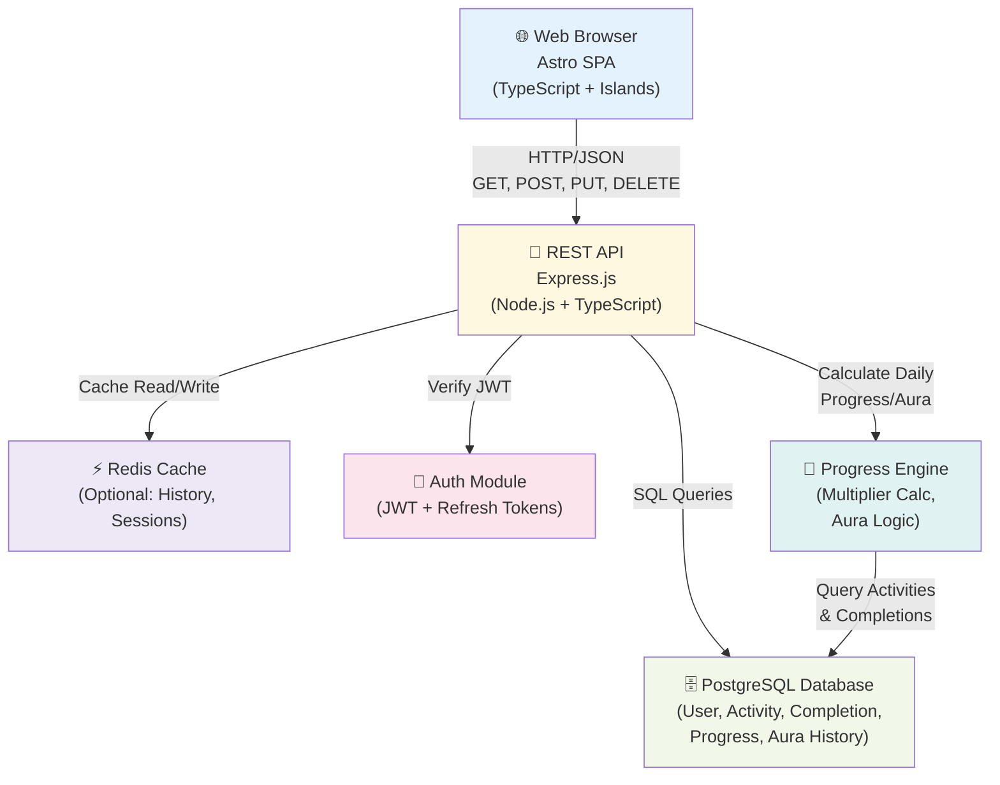

# C4 Container Diagram - CompassMe



## Responsabilidades por Container

### Web Browser (Astro 4.x)
- **Componentes**: Dashboard, Activities List, History, Settings
- **Islands Architecture**: Apenas áreas interativas são hidratadas
- **State**: TanStack Query para cache client-side
- **Storage**: LocalStorage para JWT + preferences

### REST API (Express.js)
- **Routes**:
  - `POST /auth/register` – criar usuária
  - `POST /auth/login` – login com JWT
  - `POST /auth/refresh` – refresh token
  - `GET /activities` – listar atividades do dia
  - `POST /activities` – criar atividade
  - `PUT /activities/:id` – editar atividade
  - `DELETE /activities/:id` – deletar atividade
  - `POST /completions` – marcar como completa
  - `GET /progress?date=YYYY-MM-DD` – cálculo do dia
  - `GET /history?from=&to=` – histórico filtrado
  - `GET /aura` – saldo de aura atual

### PostgreSQL Database
- **Schema**: Normalized, indexes em (user_id, date)
- **Constraints**: NOT NULL, UNIQUE, FK relationships
- **Soft-delete**: `deleted_at` column para auditoria

### Redis Cache (Optional Phase 1+)
- Cache: `progress:user_id:YYYY-MM-DD`
- Session: JWT blacklist (logout)
- Rate limit counters

### Auth Module
- **Strategy**: JWT (access token 15min, refresh token 7 days)
- **Payload**: `{user_id, role, iat, exp}`
- **Refresh Flow**: POST /auth/refresh → new access token
- **Logout**: Add token to blacklist (Redis)

### Progress Engine
- **Inputs**: Activities, Completions, DailyWeight
- **Calculation**:
  ```
  completed_count = SUM(1 for activity in today if activity.completed)
  total_count = COUNT(activities where type IN (ROUTINE, ONE_TIME))
  daily_multiplier = activity.weight × DailyWeight
  progress = (completed_count × daily_multiplier) / total_count × 100
  ```
- **Aura**: +5 (all done), +2 (partial), -1 (none)

